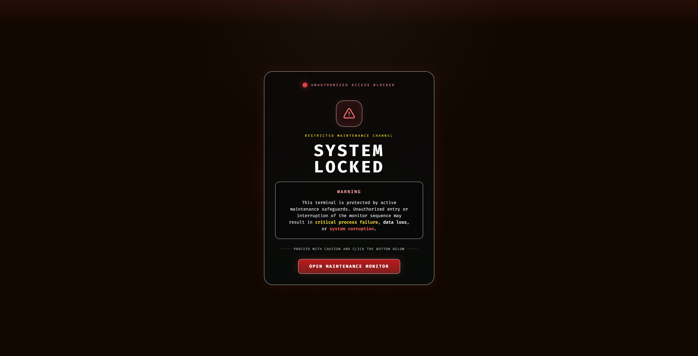

# Screen Update Interface

A browser-based maintenance-status interface built as a multi-screen front-end experience using standalone HTML, Tailwind CSS, custom CSS effects, canvas-driven visuals, and lightweight browser audio cues.

The project currently includes a primary maintenance monitor screen and a completion screen, with supporting visual assets stored in the `img/` directory. The main interface contains a locked-entry launch view, a live system monitor layout, animated telemetry panels, an ECG-style health graph, a memory usage graph, a real-time clock, and timed alert tones generated through the Web Audio API. :contentReference[oaicite:0]{index=0}

The completion screen provides a polished confirmation interface with status cards, success-state messaging, and a button that attempts to close the browser tab or window after acknowledgment. :contentReference[oaicite:1]{index=1}

## Project Structure

```text
warning/
├── img/
│   ├── main screen.png
│   ├── success screen.png
│   └── system_lock.png
├── maintenance.html
├── success.html
└── README.md
Screens Included
1. Access Lock Screen

The initial state of the main interface presents a restricted-access maintenance entry screen with warning language, a highlighted action button, and a transition into the monitoring dashboard after user interaction.

2. Maintenance Monitor

The main monitor view contains:

a maintenance-state header
real-time local system time
operator directive and sender identification panels
monitoring flags and small status cards
a live memory graph rendered on canvas
a machine health ECG-style waveform rendered on canvas
dynamic PC health percentage feedback
timed diagnostic audio beeps and periodic alert cadence behavior

These behaviors are implemented directly in maintenance.html using JavaScript, canvas rendering, timers, and browser audio context handling.

3. Completion Screen

The completion page includes:

a centered success-state card
animated highlight effects
update verification summary blocks
a completion button that attempts to close the active tab or window
a fallback message if automatic closing is blocked by the browser

This behavior is implemented in success.html.

Technical Notes
Front-End Stack
HTML5
Tailwind CSS via CDN
custom CSS animations and gradients
canvas-based graph rendering
Web Audio API for generated tones
Google-hosted web fonts on the maintenance screen
Bootstrap stylesheet loaded on the maintenance screen alongside Tailwind utilities
maintenance.html

The main maintenance interface is implemented as a full-screen browser experience. It includes:

a launch screen overlay
a hidden main dashboard that becomes visible after activation
a live system clock updated once per second
synthesized audio beeps with soft and long alert variants
animated ECG waveform logic
animated memory graph generation
randomized health-state fluctuations within a bounded range
responsive layout sections for large and smaller screens
success.html

The completion view is a separate standalone page with:

a success-shell card layout
glow, shine, and pulse animations
a structured summary of update status, verification, and system state
a button handler that calls window.close() and shows fallback text when needed
How to Run

Because the project is built as standalone HTML pages, no build process is required.

Open either of the following files directly in a browser:

maintenance.html
success.html

For the best visual behavior, use a modern Chromium-based browser.

Asset Notes

The img/ directory contains the captured screen assets used for documentation and repository preview:




These images represent the major visual states of the interface.

Use Case

This repository contains a stylized maintenance-status front-end intended for presentation, interface study, screen-flow demonstration, and browser-based visual system messaging. The project emphasizes immersive UI treatment, animated telemetry, and controlled user attention through layout, motion, status language, and audio signaling.

Notes
The main dashboard depends on browser permission to play audio after user interaction.
Automatic tab closing on the completion screen may not work in every browser context.
External CDN resources are required for full styling where internet access is available.